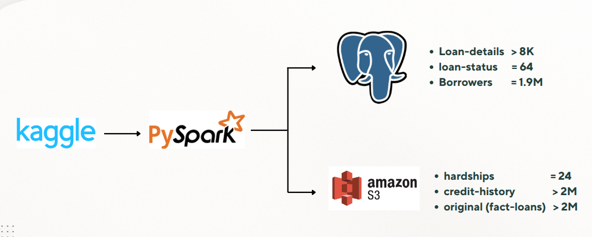
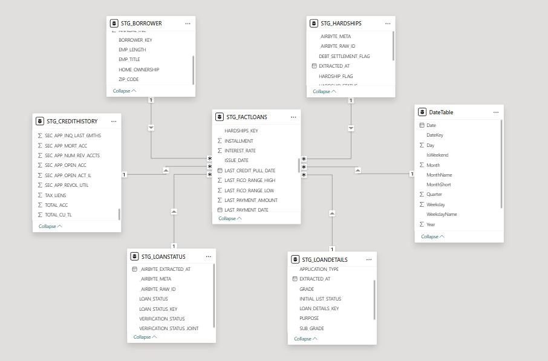
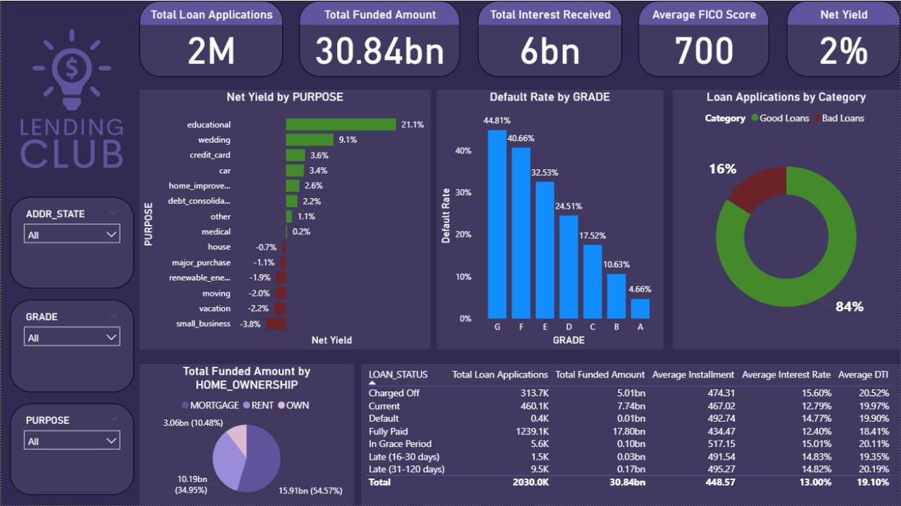

# LendingClub Credit Risk Analysis (Data Engineering Project)

## 🧠 Overview
This project focuses on analyzing LendingClub loan data to assess credit risk and build a data engineering pipeline using modern tools like PySpark, Apache Airflow, and PostgreSQL. 

## Objective
The goal is to extract insights about borrower behavior, payment history, and investor activity — and to prepare the data for downstream analytics and reporting.

**Dataset**: [Loan - Credit Risk & Population Stability](https://www.kaggle.com/datasets/beatafaron/loan-credit-risk-and-population-stability) from Kaggle. 
📚 Learn more about LendingClub [here](https://en.wikipedia.org/wiki/LendingClub).

## Project Architecture
- **Batch Pipeline**: Built a Snowflake DWH integrating PostgreSQL and S3 sources, transformed into a Star Schema, and connected to Power BI for analytics. 
      - CSV → Multi-source Simulation (Postgres/S3) using Pyspark → Airbyte → DWH / Star Schema → dbt → Dashboard.
- **Streaming Pipeline**: 
- **Deployment** : Entire stack containerized using Docker and Docker Compose.

  
## 🧱 Batch Pipeline Breakdown
1. **Data Source**: [Loan - Credit Risk & Population Stability](https://www.kaggle.com/datasets/beatafaron/loan-credit-risk-and-population-stability).
2. **Exploration**:
    - Explored LendingClub's business model and credit risk context.
    - Performed initial data cleaning and identified the schema for ETL.
3. **Multi-source Simulation**:
      - Split the dataset into 6 structured tables for better processing using pyspark.    
      - 3 tables on postgres, 3 on AWS S3.  
      
4. **DWH Star Schema":
            

6. **Dashboard**:
      

## 🛠️ Tools Used
- PySpark
- Apache Airflow
- Airbyte
- PostgreSQL
- Power BI
- Python
- S3
- dbt

## 🛡️ License
This project is licensed under the MIT License. You are free to use, modify, and share this project with proper attribution.

## 🌟 About Me
Hi there! I'm Mohamed. A Data Engineer trainee at ITI with hands-on experience in data pipelines, warehousing, and big data tools. Passionate about turning data into insights and growing my technical skills.

Let's stay in touch! Feel free to connect with me on the following platforms:  

