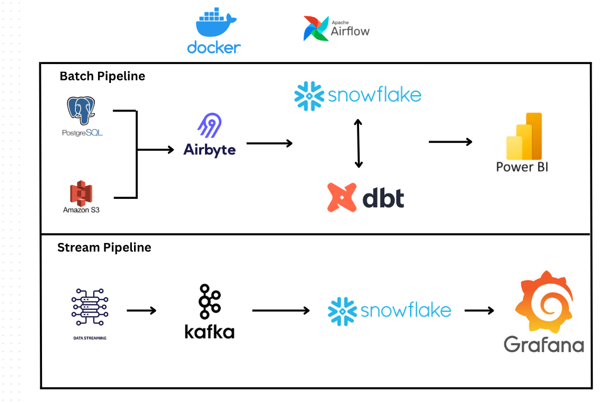
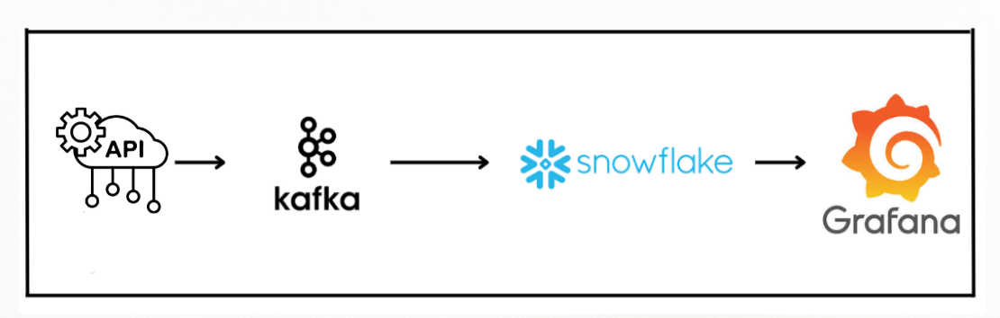

# LendingClub Credit Risk Analysis (Data Engineering Project)

## 🧠 Overview
This project focuses on analyzing LendingClub loan data to assess credit risk and build a data engineering pipeline using modern tools like PySpark, Apache Airflow, and PostgreSQL. 

## Objective
The goal is to extract insights about borrower behavior, payment history, and investor activity — and to prepare the data for downstream analytics and reporting.

**Dataset**: [Loan - Credit Risk & Population Stability](https://www.kaggle.com/datasets/beatafaron/loan-credit-risk-and-population-stability) from Kaggle. 
📚 Learn more about LendingClub [here](https://en.wikipedia.org/wiki/LendingClub).

## Project Architecture

- **Batch Pipeline**: Built a Snowflake DWH integrating PostgreSQL and S3 sources, transformed into a Star Schema, and connected to Power BI for analytics. 
      - CSV → Multi-source Simulation (Postgres/S3) using Pyspark → Airbyte → DWH / Star Schema → dbt → Dashboard.
  
- **Streaming Pipeline**: Designed a real-time data pipeline by simulating API events, streaming via Kafka, storing & processing in Snowflake, and visualizing with Grafana. 
      - API Simulation (Python, EC2, S3) → Kafka (Producer, Broker, Consumer) → Snowflake (Raw + Processed Data) → Grafana (Near Real-Time Dashboard).
  
- **Deployment** : Entire stack containerized using Docker and Docker Compose.

## 🧱 Batch Pipeline Breakdown
1. **Data Source**: [Loan - Credit Risk & Population Stability](https://www.kaggle.com/datasets/beatafaron/loan-credit-risk-and-population-stability).
2. **Exploration**:
    - Explored LendingClub's business model and credit risk context.
    - Performed initial data cleaning and identified the schema for ETL.
3. **Multi-source Simulation**:
      - Split the dataset into 6 structured tables for better processing using pyspark.    
      - 3 tables on postgres, 3 on AWS S3.       

      
4. **DWH Star Schema":       
            

6. **Dashboard**:       
        

## 🛠️ Tools Used
- PySpark
- Apache Airflow
- Airbyte
- PostgreSQL
- Power BI
- Python
- S3
- dbt

## 🚀 Streaming Pipeline Breakdown

1. **Simulated API**  
   - Generates real-time streaming data.  
   - Built using **Python** and deployed on **AWS EC2**.  
   - Stores backup data in **Amazon S3**.  

2. **Apache Kafka**  
   - Acts as the **message broker** for real-time data ingestion.  
   - Components:  
     - **Producer** → Publishes events from API to Kafka topics.  
     - **Broker** → Handles distributed streaming.  
     - **Consumer** → Reads and forwards data to Snowflake.  

3. **Snowflake**  
   - Stores **raw data** for archival purposes.  
   - Performs **data processing** and **transformations**.  
   - Stores **processed data** for visualization.  

4. **Grafana**  
   - Connects with Snowflake for **near real-time dashboards**.  
   - Provides monitoring and visualization of processed data.  

---

## ⚙️ Tech Stack  

- **Cloud**: AWS (EC2, S3)  
- **Streaming**: Apache Kafka  
- **Data Warehouse**: Snowflake  
- **Visualization**: Grafana  
- **Languages/Tools**: Python, SQL  

## 🛡️ License
This project is licensed under the MIT License. You are free to use, modify, and share this project with proper attribution.

## Team Members
Let's stay in touch! Feel free to connect with us on the following platforms:  
- Abdelrahman Tarek 
[LinkedIn](https://www.linkedin.com/in/abdelrahman-shear-0a44342a7/)
- Khaled Salah 
[LinkedIn](https://www.linkedin.com/in/khaled-salah5148/)
- Ahmed El-Sayed 
[LinkedIn](https://www.linkedin.com/in/ahmed-rostom55/)
- Mohamed Ibrahim 
[LinkedIn](https://www.linkedin.com/in/mohamed-ebrahim-8356351b2/)
- Mohamed Badr 
[LinkedIn](https://www.linkedin.com/in/mbi162/)
- Mahmoud Khalid 
[LinkedIn](https://www.linkedin.com/in/mahmoud-khalid-4b08141a1/)

## 🌟 About Me
Hi there! I'm Mohamed. A Data Engineer trainee at ITI with hands-on experience in data pipelines, warehousing, and big data tools. Passionate about turning data into insights and growing my technical skills.

Let's stay in touch! Feel free to connect with me on the following platforms:  

